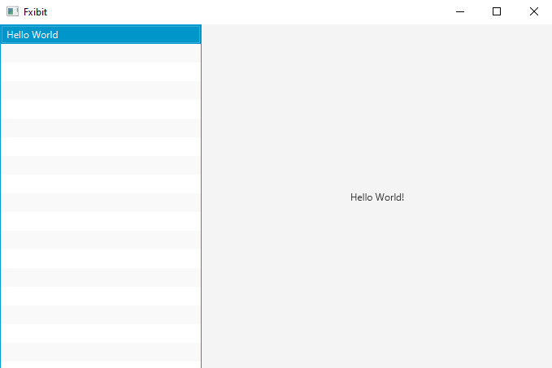

# fxibit
A JavaFX app for exhibiting your JavaFX apps.

## How it works

Fxibit loads your runnable jars from its apps directory and dependencies from its deps directory using a URL system classloader. When you select an app, Fxibit launches the app in the background and embeds its scene into an Fxibit tab.

See the examples for how to configure your apps in Gradle to be used in Fxibit.

## Features

- load runnable jars from local directory
- create native executable using jpackage
- open multiple apps in tabs
- probe app layout using nodes view
- add apps at runtime
- add apps via drag and drop
- view jar sources (.java, .fxml, .css, .md)

## Settings

Fxibit uses the following attributes from your jar manifests:
- `Main-Class` - required for runnable jars, must extend JavaFX `Application` class to work in Fxibit
- `Application-Name` - name to show in Fxibit, otherwise the classname is shown

Fxibit uses the following system properties:
- `fxibit.depsDir` - directory to load non-runnable jar dependencies from and copy to on drag-n-drop
- `fxibit.appsDir` - directory to load runnable jars from and copy to on drag-n-drop

## Tasks

- `run` - runs Fxibit locally with the example apps
- `jpackage` - creates a native installer

## Screenshot

