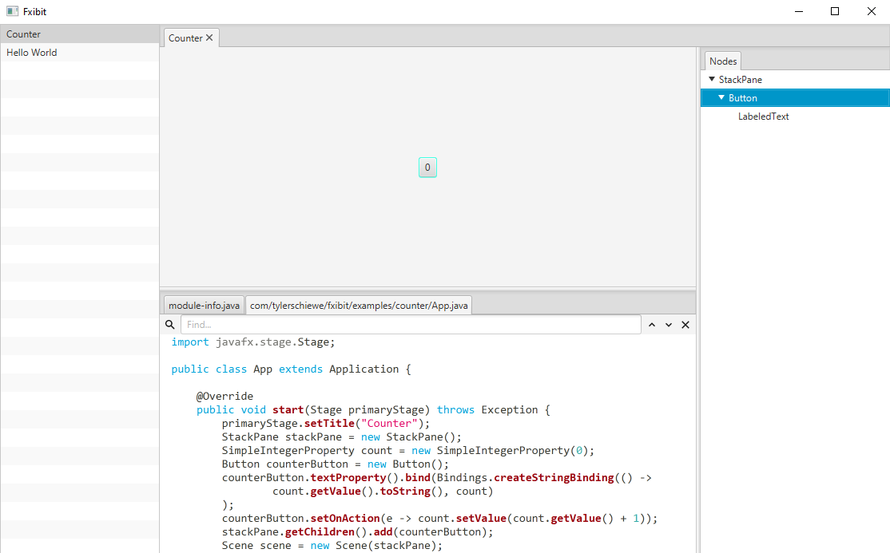

# fxibit
A JavaFX app for exhibiting your JavaFX apps.

## How it works

Fxibit loads your runnable jars from its apps directory using a dynamic classloader. When you select an app, Fxibit launches the app and embeds its scene in Fxibit's scene.

## Features

- [x] load runnable jars from local directory
- [x] create native executable using jpackage
- [x] open multiple apps in tabs
- [x] probe app layout using nodes view
- [x] add apps at runtime
- [x] add apps via drag and drop
- [ ] add apps from a maven repository
- [ ] view source files included in jar's resources

## Settings

Fxibit uses the following attributes from your jar manifests:
- `Main-Class` - required for runnable jars, must extend JavaFX `Application` class to work in Fxibit
- `Application-Name` - name to show in Fxibit, otherwise the classname is shown

Fxibit uses the following system properties:
- `fxibit.appsDir` - directory to load apps from at launch

## Tasks

- `run` - runs Fxibit locally with the example apps
- `jpackage` - creates a native installer
